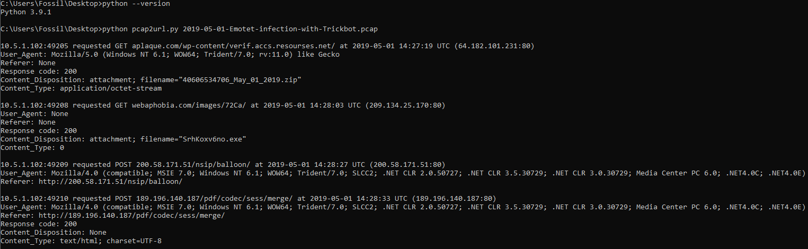

# pcap2url
Viewing HTTP request & response, extracting URLs from PCAP file

<h1>About</h1>

This script basically shows HTTP request & response, extracting URLs and filename (if any) from PCAP file into more human-friendly and beautiful format. :p

This is just a layman's coding style. Create this just for fun and for learning purpose.

<h1>Main Function</h1>

<li>This analyzer will read the PCAP file and display the result in the terminal.</li> 
The result will contains:
<ul>
  <li>Source IP</li>
  <li>HTTP Method</li>
  <li>Requested URL</li>
  <li>Timestamp</li>
  <li>Dest IP</li>
  <li>User-Agent</li>
  <li>Referer</li>
  <li>HTTP Response</li>
  <li>Filename</li>
  <li>Content_Type</li>
</ul>

<h1>How to use</h1>
<ol>
  <li>Download the Python script</li>
  <li>Ensure you have Python3+ installed (currently I'm running Python 3.9.1)</li>
  <li>Ensure you have pip installed</li>
  <li>Ensure you have Wireshark installed</li>
  <li>Install scapy, scapy-http via pip -e.g. pip install scapy scapy-http</li>
  <li>Run the script: python pcap2url.py sample.pcap</li>
  <li>Profit! :)</li>
</ol>

<li>Any feedback are welcomed. You can contact me via email at <b>m[d0t]khairulazam@gmail[d0t]com</b>.</li>

<li>Credit for this <a href="http://snippets1000.blogspot.my/2012/09/scapy-and-http.html">blog</a> for the original code. :)</li>
